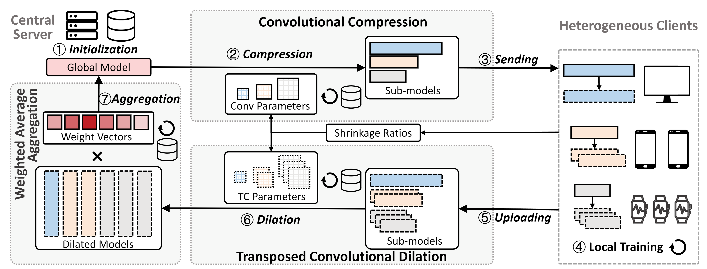

# FedConv: A Learning-on-Model Paradigm for Heterogeneous Federated Clients
Federated Learning (FL) facilitates collaborative training of a shared global model without exposing clients’ private data. In practical FL systems, clients (e.g., edge servers, smartphones, and wearables) typically have disparate system resources. Conventional FL, however, adopts a one-size-fits-all solution, where a homogeneous large global model is transmitted to and trained on each client, resulting in an overwhelming workload for less capable clients and starvation for other clients. To address this issue, we propose FedConv, a client-friendly FL framework, which minimizes the computation and memory burden on resource-constrained clients by providing heterogeneous customized sub-models. FedConv features a novel learning-on-model paradigm that learns the parameters of the heterogeneous sub-models via convolutional compression. Unlike traditional compression methods, the compressed models in FedConv can be directly trained on clients without decompression. To aggregate the heterogeneous sub-models, we propose transposed convolutional dilation to convert them back to large models with a unified size while retaining personalized information from clients. The compression and dilation processes, transparent to clients, are optimized on the server leveraging a small public dataset. Extensive experiments on six datasets demonstrate that FedConv outperforms state-of-the-art FL systems in terms of model accuracy (by more than 35% on average), computation and communication overhead (with 33% and 25% reduction, respectively).


## Requirements
- Hardware
    - A server with GPU
    - Multiple clients (edge devices)
- Software
    - Operating System: Ubuntu 22.04 LTS
    - Python 3.10.12
    - PyTorch 1.13.1+cu117
    - Flower 1.6.0

## FedConv Overview



- Server
    - Initialize a large global model.
    - Apply _Convolutional Compression_ on the large global and generate heterogeneous sub-models for clients.
    - Apply _Transposed Convolutional Dilation_ on the received heterogeneous client models to transform them into large models.
    - Apply _Weighted Average Aggregation_ on the rescaled large models and perform model aggregation for the next global communication round.

- Heterogeneous Clients
    - Perform their resource profiles to determine a set of shrinkage ratios and transmit the shrinkage ratios to the server.
    - Perform local training as in traditional FL.

## Project Structure
```
|-- datasets                    // datasets used for evaluation
    |-- Image
        |-- MNIST
        |-- CIFAR10
        |-- CINIC10
    |-- HAR
        |-- WiAR
        |-- Depth_Camera
        |-- HARBox

|-- network_architecture        // models for different datasets
    |-- MNIST.py
    |-- CIFAR.py
    |-- CINIC.py
    |-- WiAR.py
    |-- Depth_Camera.py
    |-- HARBox.py

|-- Results                     // evaluation results
    |-- evaluation              // includes global model accuracy and client model accuracy
    |-- memory                  // includes CPU & GPU memory usage, network usage, and wall-clock time
    |-- saved_models            // saved state_dict
    |-- weight_vector           // saved weight vectors

|-- utils                       // FedConv settings
    |-- client_settings.py      // client-side model related settings
    |-- data_processing.py      // data loading & processing related settings
    |-- federated settings.py   // convolutional compression, TC dilation, and weighted aggregation-related settings

|-- Replace                     // modified PyTorch packages
    |-- batchnorm.py
    |-- conv.py
    |-- init.py
    |-- linear.py
    |-- module.py

|-- images                      // figures used in this README.md

|-- state_dict                  // temporary folder for saving intermediate state_dict

|-- config.py                   // configuration for hyper-parameters of FedConv
|-- server.py                   // run server
|-- client.py                   // run client
|-- strategy.py                 // FL strategies: FedConv
|-- README.md
|-- requirements.txt
```

## Quick Start
### 1. Installation
```bash
pip3 install -r requirements.txt --extra-index-url https://download.pytorch.org/whl/cu117
```

### 2. PyTorch Package Modification
Replace the following Python files from your local Python environment with the files provided in the `Replace` folder:

```
/usr/local/lib/python3.10/dist-packages/torch/nn/modules/module.py
/usr/local/lib/python3.10/dist-packages/torch/nn/modules/conv.py
/usr/local/lib/python3.10/dist-packages/torch/nn/modules/batchnorm.py
/usr/local/lib/python3.10/dist-packages/torch/nn/modules/linear.py
/usr/local/lib/python3.10/dist-packages/torch/nn/init.py
```

Note that the paths to the above files may vary based on your local Python environment.

### 3. Server Configuration
```bash
python3 server.py
```

### 4. Client Configuration
```bash
python3 client.py --client_id 0
python3 client.py --client_id 1
python3 client.py --client_id 2
...
python3 client.py --client_id 9
```

## Notes
- Feel free to modify the hyper-parameters in the `config.py`
- The default number of clients is 10.
- Please don't hesitate to reach out if you have any questions.
- Due to the limited space, we only uploaded the MNIST dataset to the repository. You can download other datasets from their official websites and use "Dirichlet distribution" to split them.

## Citation
```
@inproceedings{shen2024fedconv,
  title={FedConv: A Learning-on-Model Paradigm for Heterogeneous Federated Clients},
  author={Shen, Leming and Yang, Qiang and Cui, Kaiyan and Zheng, Yuanqing and Wei, Xiao-Yong and Liu, Jianwei and Han, Jinsong},
  booktitle={Proceedings of the 22st Annual International Conference on Mobile Systems, Applications and Services},
  pages={1--14},
  year={2024}
}
```

## Output Specification
1. Global model accuracy
    - The global model accuracy will be recorded in `./Results/evaluation/server.json`
    - The format of the JSON file will be
        ```json
        {
            "0": {
                "validation_accuracy": 90.90,
                "validation_loss": 2.30,
                "test_accuracy": 90.90,
                "test_loss": 2.30
            },
            ...,
            "100": {
                "validation_accuracy": 90.90,
                "validation_loss": 2.30,
                "test_accuracy": 90.90,
                "test_loss": 2.30
            }
        }
        ```
    - Each key in the JSON represents the index of global communication round.
    - Each value in the JSON is also a JSON recording the validation accuracy, validation loss, test accuracy, and test loss calculated on the IID server-side global data for *convolution/TC parameter* fine-tuning and the IID test data for evaluating the global model, respectively.
2. Client model accuracy
    - The client model accuracy will be recorded in `./Results/evaluation/client_{}_evaluate.json`
    - The format of the JSON file will be
        ```json
        {
            "1": {
                "testing_loss": 0.006,
                "testing_accuracy": 98.7
            },
            ...,
            "100": {
                "testing_loss": 0.006,
                "testing_accuracy": 98.7
            }
        }
        ```
    - Each key in the JSON represents the index of global communication round.
    - Each value in the JSON is also a JSON recording the test accuracy, and test loss calculated on the non-IID client-side private data for personalization performance evaluation.
3. CPU & GPU memory
    - The memory usage of each client will be recorded in `./Results/memory/cpu_gpu_memory_client{}.json`
    - The format of the JSON file will be
        ```json
        {
            "1689128485": {
                "CPU": 1114.01171875,
                "GPU": 0.080078125
            },
            ...,
            "1689171710": {
                "CPU": 2495.73046875,
                "GPU": 16.9375
            }
        }
        ```
    - Each key in the JSON represents a certain timestamp.
    - Each value in the JSON is also a JSON recording the CPU and GPU memory usage (in MB) at a certain timestamp.

**We provide our original experiment results at `demo_results` for your references.**

## Q&A
- grpc connection error
	- Error `grpc_message:"failed to connect to all addresses; last error: UNKNOWN: ipv4:127.0.0.1:8080: Failed to connect to remote host: Connection refused"`
	- Solution
		- When running clients, please modify a variable named `server_address` in `config.py` to the ground truth IP address of your server.
		- Make sure that your server has opened the firewall port `8080` and that no other processes are occupying this port.
		- More detailed issues can be found on [Flower Issues](https://github.com/adap/flower/issues/537)